# Conventions pour le projet Inote :

*À compléter* au fur et à mesure des besoins :
**pour chaque ajout imposer une revue de code entre les contributeurs pour qu’ils puissent être informés et se mettre d’accord.**

---

## Convention de nommage

### Casses

On a les casses suivantes :
- Nom de classe en *Pascal case* : `MyFirstClass` ;
- Nom de variable en *camel case* : `numberOfProcess` ;
- Nom de méthode en *camel case* : `createUser()` ;
- Nom de constante en *upper snake case*: `MAX_USER_NBR` ;
- Nom de *package* ou de module en *kebab case* : `my-first-package`.

### Nommages

Une méthode correspond à un groupe verbal.

Une variable booléenne correspond à un groupe verbal d’état : `isActivated`, `canBeDestroyed` etc.

Toute autre variable correspond un groupe nominal.

Une interface correspond à une capacité ou un groupe adjectival : `Colorizable`, `AbleToDie` etc.

## Git

### Stratégie d’organisation des *commits* sur la branche principale

La branche `main` va contenir le code opérationnel du projet.
Dans l’optique de maintenir un historique clair et aisément navigable, la stratégie d’organisation des *commits* et d’intégration de code au dépôt distant suit deux cas.

Lorsqu’**une branche correspond à une étape clée** d’un projet (fonctionnalité, *user story*…) qui nécessite une **visibilité immédiate dans l’historique**, son intégration dans la branche `main` se fera à l’aide de la commande `git merge`.
Ceci aura l’effet de mettre en évidence cet apport sous la forme d’une ***bosse*** aisément identifiable. 
**La branche sera alors concervée** après son intégration.

Lorsqu’une branche de code **n’existe que pour une raison purement technique**, une *bosse* polluerait  visuellement : le code sera donc intégré à l’aide de la commande `git rebase`.
**La branche est supprimée** une fois intégrée.

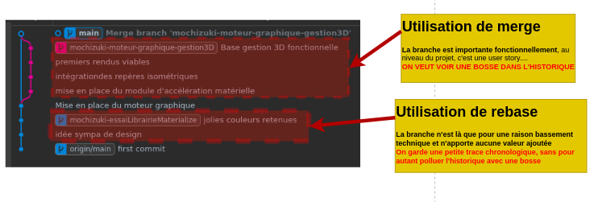

L’organisation de code partagé, avec Git et Github, s’avère être une partie sensible qui peut rapidement devenir *incontrôlable*.
Nous nous imposerons pour minimiser les problèmes les règles suivantes :
- **Un seul développeur sur une branche** ;
- Il n’y a que lors des requêtes de tirage en fin de journée que les *commits* de différents contributeurs se côtoient sur une même branche ;
- Le code à intégrer à la branche principale se fait toujours par l’intermédiaire d’une requête de tirage, **en fin de journée** ;
- Le code doit toujours être révisé ;
- Le code **ne fusionne jamais** vers la branche principale **par son auteur** ;
- Le contributeur **qui fusionne** le code doit l’avoir **révisé avant** ;
- Le code sera intégré sur la branche principale directement depuis Github, c’est à cette occasion que la stratégie de fusion ou de rebasage sera à réfléchir ;
- La gestion des requêtes de tirage s’effectuant **le soir** ;
- Les contributeurs commencent toujours leur travail de la journée par un `git fetch` pour récupérer les dernières évolutions du dépôt distant et pouvoir les visualiser ;
- Le contributeur a la responsabilité de supprimer, au moment où il le souhaite, ses branches mineures qui ont été rebasées devant la branche principale.

#### Scénario d’illustration du flux de travail (*workflow*)

##### 1. *Commit* initial

La branche `main` est crée avec un *commit* initial.

L’utilisateur *Sangoku* commence à travailler sur la mise en place de la configuration de son environnement de travail.
Il crée une branche `sangoku-environment_setup`.

L’utilisateur *Krilin* commence à travailler sur le modèle de données du système.
C’est une étape importante car la base de donnée reposera sur ce travail.
Il crée la branche `krilin-setting_up_information_system_entities`.

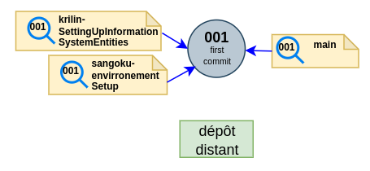

##### 2. Fin de journée

Les contributeurs poussent leurs avancées de la journée.

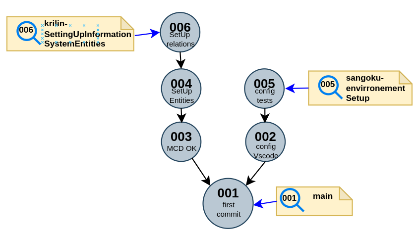

On voit ci-dessous le graphe de Git.

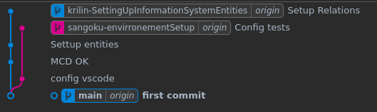

##### 3. Demande d’intégration

Sangoku fait une demande d’intégration de son code à la branche principale **en ouvrant une requête de tirage sur Github**.

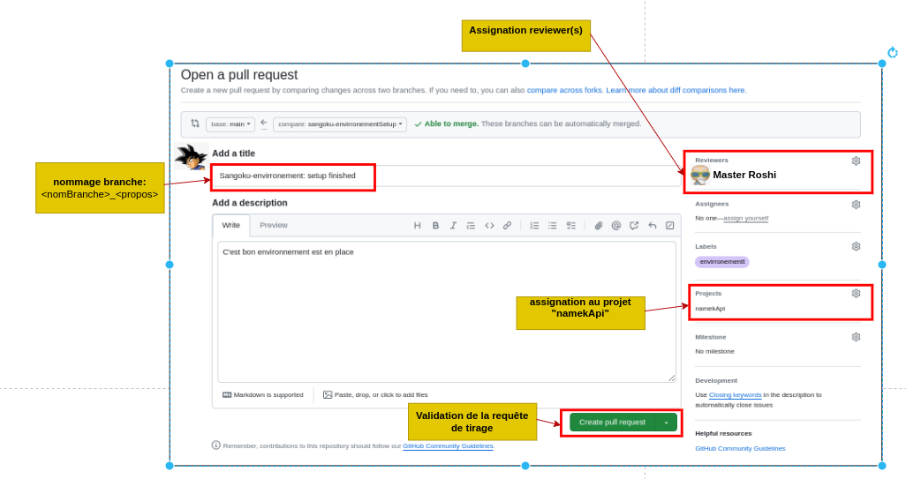

Pour finir, après avoir cliqué sur le bouton *Create pull request*, **il assigne sa requête de tirage à la colonne *Pull request review*** du projet.

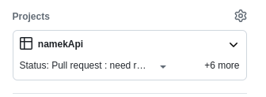

Krilin fait de même.

##### 5. Rencontre du troisième type

Quand toutes les requêtes de tirage de la journée sont ouvertes on peut imaginer qu’un troisième contributeur se rend sur le **kanban du projet**.
Il voit deux requêtes de tirage à traiter comme le graphe ci-dessous.

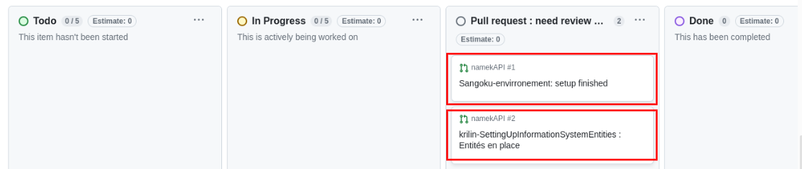

##### 6. Revue de code léger

Il commence par traiter le travail de Sangoku.
Cette branche est uniquement technique.
Ainsi, après avoir révisé le code, il le valide et l’intègre à la branche `main` avec un **rebasage**.

Il n’y aura pas de *bosse* qui polluera l’historique de la branche principale, mais une trace de chaque *commit* de Sangoku sera gardée.

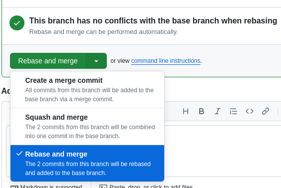

##### 7. Revue de code lourd

Il traite ensuite le travail de Krilin.
Le travail de ce dernier est une étape importante qui doit être à ce titre être visuellement explicite dans l’historique.
Il révise et valide le code puis le rapatrie en effectuant une **fusion** vers `main`.
Ceci donne lieu à l’apparition d’un **nouveau *commit*** sur la branche `main`.

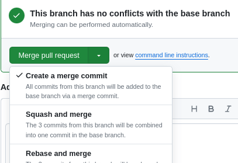

*Nota bene* : On peut constater que le statut des requêtes de tirage passe **automatiquement à *Done*** dans le kanban après l’opération.

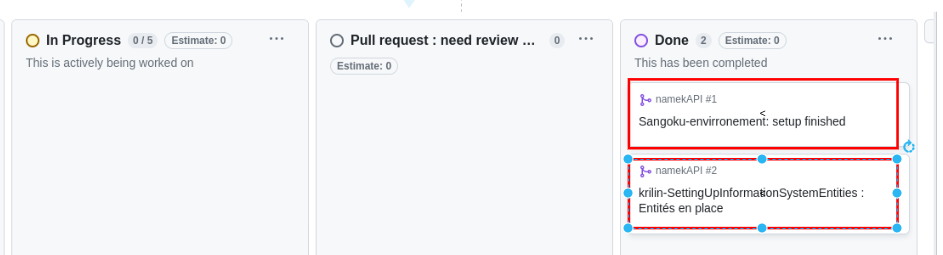

##### 8. Retour au boulot

Le lendemain matin Sangoku se remet au travail.
Il commence toujours par faire un `git fetch` pour récupérer le résultat du traitement des requêtes de tirage qui s’est effectué la veille au soir.

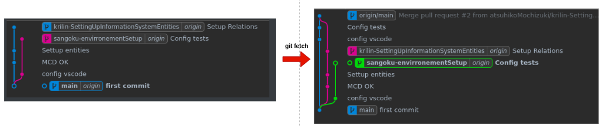

Il peut ainsi constater le prochain graphe.

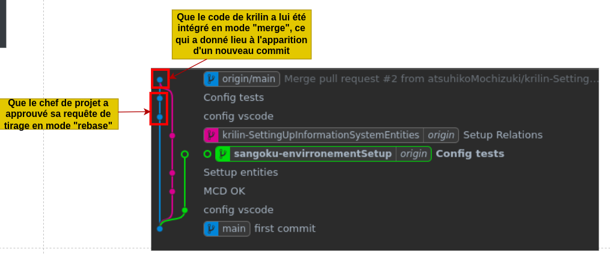

##### 9. Nouvelle fonctionnalité

Sangoku se rend sur le kanban.
On lui demande de coder aujourd’hui la fonctionnalité *kamehameha*.
Il place cette tâche dans la colonne *In progress*. 


Sangoku revient sur son code et se place sur la branche `main` en faisant `git checkout main`.

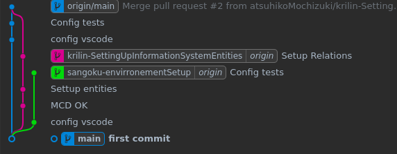

Comme sa branche est mineure (rebasée) il la supprime pour éviter de polluer l’historique comme suit :
- **Dépôt local** : `git branch  -d sangoku-setting_up_informations_system_entities` ;
- **Dépôt distant** : `git push origin --delete sangoku-setting_up_informations_system_entities`.

Il rapatrie ensuite, toujours sur la branche `main`, le code ajouté sur le dépot distant via `git merge origin/main`.
Cette commande le positionne au dernier `commit`.

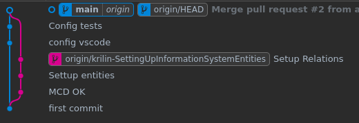

Puis il crée une nouvelle branche via `git checkout -b sangoku-kamehameha` et continue son travail.

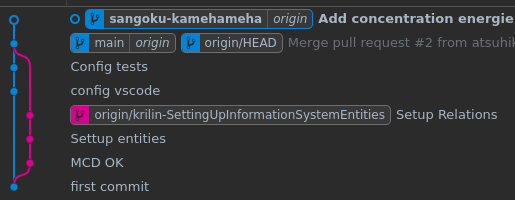

…Et ainsi de suite.

#### `git fetch` ? `git pull --rebase` ? `git pull --no-ff` ?

Le flux de travail que nous venons de voir à limité les problèmes.

Néanmoins le dessin ci-dessous récapitule brièvement quelques façons de procéder lorsque la branche distante diffère de la branche locale.

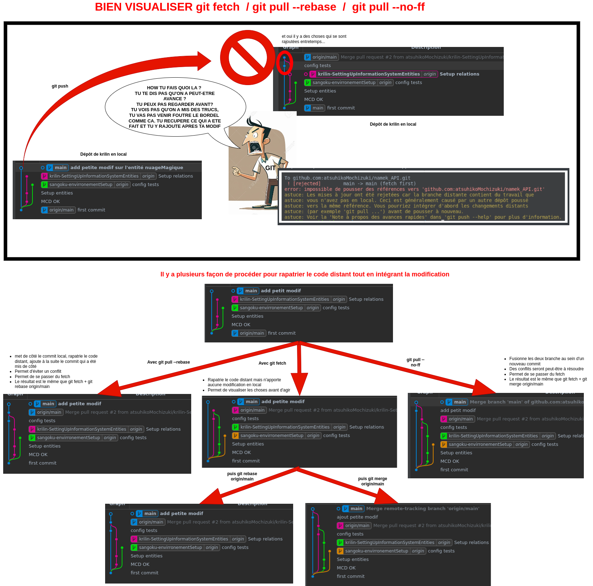

### Nommage

#### Branches

Toute branche débute en *lower snake case* par un pseudonyme ou ses initiales puis vient le sujet de la branche comme suit :
```my_pseudonyme-the_purpose_to_implement```.
Le sujet de la branche est en Anglais.

La branche `main` est principale.
Toute fusion vers elle exige une requête de tirage et une revue de code.

#### Requête de tirage

La requête de tirage débute par un commentaire dont le titre est le sujet de la branche.


## Serveur frontal (Angular)

### Stratégie de génération de composants
Les règles de gestion des composants retenues sont les suivantes:
- **Absence de fichier vide**
- **L'application d'un style css ou l'association d'un template html donne lieu à l'apparition d'un fichier dédié, *quelque soit le nombre de ligne de code qu'il contiendra*.**

Dans cette optique, la stratégie par défaut de génération de composant donnera lieu à l'apparition de 2 fichiers:
- Un fichier ts
- Son spec.ts associéè 

### Échanges HTTP

Le serveur Angular initiera les requêtes HTTP à l’aide du service `HttpClient` d’Angular qui sera injecté via le constructeur de la classe.
Ce dernier est activé dans l’application par l’import de `HttpClientModule` depuis le module racine dans `src/app/app.module.ts`.

Le lancement d’une requête se fera au sein d’une méthode dans un service dédié. 
Cette dernière : 
- Comportera en arguments les données à envoyer le cas échéant ;
- Devra renvoyer un observable dont le type générique correspondra à l’objet renvoyé dans le corps de la réponse ;
- Implémentera la JSON pour transmettre les données ;
- Devra donc contenir l’en-tête HTTP ```{ "content-type": "application/json" }``` le cas échéant ;
- La méthode comportera l’option `observe` afin de pouvoir accéder à la réponse complète (*body*, *headers*, *status code*…) ;
- Si la requête necessite une authentification elle sera de la forme suivante :
```typescript
const headers = { Authorization: `Bearer ${bearer}` };
```

Nota bene : le *bearer* est le JWT reçu lors de la connexion au service.

Exemple d’un service implémentant des requêtes HTTP :
```typescript
@Injectable()
export class PublicUserService {
  // Http client injection
  constructor(private http: HttpClient) {}

 /**
   * loginUser user
   *
   * @param emailToSend : string
   * @param passwordToSend : string
   *
   * @returns Observable on HttpResponse<CredentialsDto> that contains jwt & refresh-token
   *
   * @author AtsuhikoMochizuki
   * @date 17-05-2024
   */
  loginUser(
    emailToSend: string,
    passwordToSend: string
  ): Observable<HttpResponse<CredentialsDto>> {
    return (
      //Envoi de la requête
      this.http
        // Method type whith type of attempted data in body response
        .post<CredentialsDto>(
          // Url
          BackEndPoints.SIGN_IN,
          //Serialized body data
          JSON.stringify({
                username: emailToSend,
                password: passwordToSend,
          }),
          //Options
          {
            headers: { "content-type": "application/json" },
            observe: "response"
          }
        )
    );
  }
}
```

L’exploitation de la méthode implémentant la requête et retournant un observable :
- Devra prévoir le scénario en cas d’erreur ;
- Devra pouvoir manipuler les informations retournées (*body*, *status*…).

Exemple :
```typescript
/**
   * Login the user
   *
   * @param email:string
   * @param password:string
   *
   * @author AtsuhikoMochizuki
   * @date 17-05-2024
   */
  private login(email: string, password: string) {
    // Service call
    this.publicUserservice
      // Service method call with datas to send in body
      .loginUser(email, password)
      // Observable subscription
      .subscribe(
        // Handle successful response
        (response: HttpResponse<CredentialsDto>) => {
          this.statusAfterRequest = response.status;
          if (this.statusAfterRequest == 200) {
            this.credentialsDto = response.body;
            if (this.credentialsDto)
              this.tokenService.saveToken(this.credentialsDto?.bearer);
            this.router.navigate(["dashboard"]);
          }
        },
        // Handle error
        (error: HttpErrorResponse) => {
          this.statusAfterRequest = error.status;
          this.msgAfterRequest = error.error.detail;
          return throwError(error.message);
        }
      );
  }
```

Autre exemple en utilisant une méthode qui centralise la gestion de l’erreur :
```typescript
private login2(email: string, password: string) {
  // Service call
  this.publicUserservice
    // Service method call with datas to send in body
    .loginUser(email, password)
    .pipe(catchError(this.handleError))
    // Observable subscription
    .subscribe(
      // Handle successful response
      (response: HttpResponse<CredentialsDto>) => {
        this.statusAfterRequest = response.status;
        if (this.statusAfterRequest == 200) {
          this.credentialsDto = response.body;
          if (this.credentialsDto) {
            this.tokenService.saveToken(this.credentialsDto?.bearer);
          }
          this.router.navigate(["dashboard"]);
        }
      },
      // Handle error
      (error: HttpErrorResponse) => {
        this.statusAfterRequest = error.status;
        this.msgAfterRequest = error.error.detail;
        return throwError(error.message);
      }
    );
}

handleError(error: HttpErrorResponse) {
  let errorMessage = "Unknown error!";
  if (error.error instanceof ErrorEvent) {
    // Client-side errors
    errorMessage = `Error: ${error.error.message}`;
  } else {
    // Server-side errors
    errorMessage = `Error Code: ${error.status}\nMessage: ${error.message}`;
  }
  window.alert(errorMessage);
  return throwError(errorMessage);
}
```

### *Data Transfert Objects*

Les noms de ces classes seront suffixés par `Dto` et ils implémenteront une méthode de sérialisation comme suit :
```typescript
export class CredentialsDto {
  public bearer: string;
  public refresh: string;

  constructor(bearer: string, refresh: string) {
    this.bearer = bearer;
    this.refresh = refresh;
  }

  serializedData(): string {
    return JSON.stringify(this);
  }
}
```
### Classes TypeScript

Hormis de très rares cas, les constructeurs des classes TypeScript dans Angular doivent rester vides.
Il ne serviront la plupart du temps qu’à injecter les dépendances.

Toute initialisation d’attribut s’effectuera dans la méthode Angular dédiée à cet effet : `ngOnInit`.

## Serveur dorsal (Spring Boot)

### Gestion des échanges HTTP par les *REST controllers*

#### Conventions pour les *RestControllers*

Les classes responsables des échanges avec le serveur dorsal seront annotées par `@RestController`.
Cette annotation est spécialement désignée pour les API REST qui manipulent des données HTTP.
Ainsi : 
- Le contrôleur retourne directement des données, automatiquement sérialisées dans le format choisi et envoyé dans le corps de la réponse.
- L’annotation @ResponseBody n’est plus nécessaire

Les contrôleurs : 
- Renverront *status*, *body* et — le cas échéant — *headers* pour une possibilité d’exploitation maximale côté Angular ;
- Retourneront `ResponseEntity<typeReturnedData>` à fin de laisser la possibilité d’une exploitation complète de la réponse côté Angular.

Le nom du contrôleur respectera la forme :  `<TypeExceptionManaged>Handler`.
Si le contrôleur doit recevoir une donnée un DTO dédié annoté `@RequestBody` sera intégré en tant que paramètre de la méthode.

*exemple : *

```java
@Slf4j // For output errors in console
@RestControllerAdvice	// Exception Centralized manager
public class ApplicationControllerAdvice {

/**
 * Create user account
 * 
 * @param userDto   Attempted type of data (@ResponseBody is not necessary because using @RestController)
 * @return ResponseEntity<String> Response entity (http gestion facilities) that contains type of data in response body
 * @throws InoteExistingEmailException
 * @throws InoteInvalidEmailException
 * @throws InoteRoleNotFoundException
 * @throws InoteInvalidPasswordFormatException
 * 
 * @author atsuhikoMochizuki
 * @date 19/05/2024
 */

@PostMapping(path = Endpoint.REGISTER)  // HTTP method + Endpoint
public ResponseEntity<String> register(/*@RequestBody*/ UserDto userDto) { 
    User userToRegister = User.builder()
            .email(userDto.username())
            .name(userDto.name())
            .password(userDto.password())
            .build();
    try {
        this.userService.register(userToRegister);
    } catch (InoteMailException | InoteExistingEmailException | InoteInvalidEmailException
            | InoteRoleNotFoundException
            | InoteInvalidPasswordFormatException ex) {

        return ResponseEntity
            // Status code
            .badRequest()
            //body response
            .body(ex.getMessage());
    }

    return ResponseEntity
        // status code
        .status(HttpStatusCode.valueOf(201))
        // body response
        .body(MessagesEn.ACTIVATION_NEED_ACTIVATION);
}
```

#### Modèle d’implémentation des exceptions

Les exceptions seront placées dans la couche crossCutting/exceptions. 
Le message associé fera référence à une constante définie dans la classe MessageEn.

```java
public class InoteInvalidEmailFormat extends Exception{
    public InoteInvalidEmailFormat(){
        super(EMAIL_ERROR_INVALID_EMAIL_FORMAT);
    }
}
```


#### Centralisation des exceptions attrapées dans les controllers REST

La gestion des exceptions attrapées dans les RestControllers de l’api sera sera centralisée dans la classe ApplicationControllerAdvice. 

Voilà comment procéder lorsque l’on souhaite ajouter une exception:

1. On crée l’exception dans la couche crossCutting/exceptions

   *exemple InoteInvalidEmailException.java:*

```java
public class InoteInvalidEmailException extends Exception {
    public InoteInvalidEmailException(){
        super(EMAIL_ERROR_INVALID_EMAIL_FORMAT);
    }
}
```

2. On rajoute ensuite cette exception dans ApplicationControllerAdvice. 
   On y précisera, à l’aide de la classe ProbemDetail

   - Le status code à renvoyer
   - Le message à afficher, qui devra être celui de l’exception
     *exemple:*

   ```java
   @Slf4j	// For output errors in console
   @RestControllerAdvice // Handle exceptions in a centralized way for all controllers 
   public class ApplicationControllerAdvice {
   
       @ExceptionHandler(value = InoteInvalidEmailException.class)
   	public ProblemDetail InoteInvalidEmailException(InoteInvalidEmailException ex) {
   	// Loging error in console
       log.error(ex.getMessage(), ex);
   	
       return ProblemDetail
           .forStatusAndDetail(
               // return status code
               BAD_REQUEST,
               // return reason
               ex.getMessage());
   	}
   }
   ```

Nota : si aucune exception ne correspond à une de celles présente dans la couche crossCutting/exception, l’exception par défaut inoteDefaultExceptionsHandler est appelée:
```java
/**
 * Default exception handler
 * 
 * @param ex Default type exception
 * @return a 401 status code with exception cause
 * @author atsuhikoMochizuki
 * @date 19-05-2024
 */
@ExceptionHandler(value = Exception.class)
public ProblemDetail inoteDefaultExceptionHandler(Exception ex) {

    // Loging error in console
    log.error(ex.getMessage(), ex);

    return ProblemDetail
            .forStatusAndDetail(
                    // return status code
                    BAD_REQUEST,
                    // return reason
                    ex.getMessage());
}
```

Nota : Spring boot propose certaines annotations permettant de simplifier :
```java
@ResponseStatus(value = HttpStatus.BAD_REQUEST, reason = "Received Invalid Input Parameters")
    @ExceptionHandler(InputValidationException.class)
    public void handleException(InputValidationException e) {
        // Handle the exception and return a custom error response
    }
```

Nous ne l’utilisons pas dans la plupart des cas car nous souhaitons récupérer la cause de l’exception générée.

#### Sérialisation / Dé-sérialisation des objets JSON

La classe ObjectMapper sera utilisée à cette effet.

- Sérialisation d’un donnée au format JSON
  ```java
  ObjectMapper mapper = new ObjectMapper();
  Map<String, String> map = new HashMap<>();
  map.put("key1", "value1");
  map.put("key2", "value2");
  
  String jsonString = mapper.writeValueAsString(map);
  ```

  A noter que dans le cas précis des controllers, qui sont annotés par @RestController, les données en retournées au front sont automatiquement sérialisées:
  ```java
  @PostMapping(path = Endpoint.SIGN_IN)
  public ResponseEntity<SignInDtoresponse> signIn(@RequestBody AuthenticationDtoRequest authenticationDtorequest) throws AuthenticationException{
  	/* ... */
      return ResponseEntity
              .status(OK)
              .body(signInDtoresponse);
  }
  ```

  

- Désérialisation d’un objet JSON
  soit l’objet JSON sérialisé  récupéré lors d’un test:
  *returnedResponse = response.andReturn().getResponse().getContentAsString();*

  ```java
  {
      "bearer":"fjsdlfjsljfl",
      "refresh":"jkdshfjkhdskfhksfhk"
  }
  ```

  Pour retrouver l’objet Java à l’aide de ObjectMapper:
  ```java
  SignInDtoresponse signInDtoresponse = this.objectMapper.readValue(returnedResponse, SignInDtoresponse.class);
  ```

  A noter que pour les objets sérialisés en provenance du frontend, fournis en paramètres d’un controller, il suffira d’utiliser l’annotation @RequestBody pour désérialiser la donnée:
  ```java
  @PostMapping(path = Endpoint.SIGN_IN)
  public ResponseEntity<SignInDtoresponse> signIn(@RequestBody AuthenticationDtoRequest authenticationDtorequest) throws AuthenticationException{ /*...*/ }
  ```

  

### Javadoc

#### Méthodes

```java
/**
* Save validation in database
*
* @param user the user to save
* @author atsuhiko Mochizuki
* @throws InoteMailException 
* @throws MailException 
* @date 2024-03-26
*/
Validation createAndSave(User user) throws InoteInvalidEmailException, MailException, InoteMailException;
```

### Entités

Hormis le fait de ne pas implémenter obligatoirement `Serializable` les entités respecteront la forme Javabean :
  - La classe est simple et ne fait référence à aucun cadriciel particulier ;
  - La classe ne doit pas être déclarée `final` ;
  - La classe contient une variable `id` annotée `@Id` de type non-primitif `Integer` ;
  - Les propriétés sont privées et exposées par des accesseurs et mutateurs via `@Data` ;
  - La présence d'un constructeur sans arguments annote `@NoArgsConstructor` la classe ;
  - *La classe est sérialisable alors elle doit implémenter `Serializable`* ;
  - La classe qui implémente les surcharges des méthodes `equals()` et `hashCode()` doit être annotée `@Data`.

  On obtient alors ceci :
  ```java
  @Builder
  @Data
  @NoArgsConstructor
  @AllArgsConstructor 
  @Entity
  @Table(name="user") // Si "user" est un mot réservé, pose problèmes que @Table résoud implicitement.
  public class User{
    @Id
    @GeneratedValue(strategy = GenerationType.IDENTITY)
    private Integer id;
  }
  ```

### *Data Transfert Objects*

Les DTO sont des registres Java suffixés comme ci-dessous :
```java
public record CommentDtoResponse(
        Integer id,
        String message,
        Integer UserId
) {}
```

Le suffixe peut être `DtoRequest` pour une donnée de requête reçue ou `DtoResponse` pour une donnée de réponse émise.

### Services

Pour un couplage minimal avec les contrôles, les services exposeront une interface.

Le service est suffixé par `Service`.

L’interface porte le nom de son service suffixé par `Impl`.

### Test

Une classe de test unitaire est suffixée par `Test` : `<classeTestee>Test`.

Une classe de test d’intégration est suffixée `_IT` : `<classeTestee>_IT`.

Un méthode de test unitaire est nommée selon la forme des trois A : *Arrange*, *Act* et *Assert* comme ci-dessous :
```<nomFonction>__<resultatAttendu>__when<condition>```.

Elle devra être annotée `@DisplayName`.
Exemple :
```java
@Test
@DisplayName("Load an user registered in db with username")
public void loadUserByUsername_shouldReturnUser_whenUserNameIsPresent() {
  /* Arrange */
  when(this.userRepository.findByEmail(this.userRef.getUsername())).thenReturn(Optional.of(this.userRef));

  /* Act & assert */
  assertThat(this.userService.loadUserByUsername(this.userRef.getUsername())).isNotNull();
  assertThat(this.userService.loadUserByUsername(this.userRef.getUsername())).isInstanceOf(User.class);
  assertThat(this.userService.loadUserByUsername(this.userRef.getUsername())).isEqualTo(this.userRef);

  /* Verify */
  verify(this.userRepository, times(3)).findByEmail(any(String.class));
}
```
